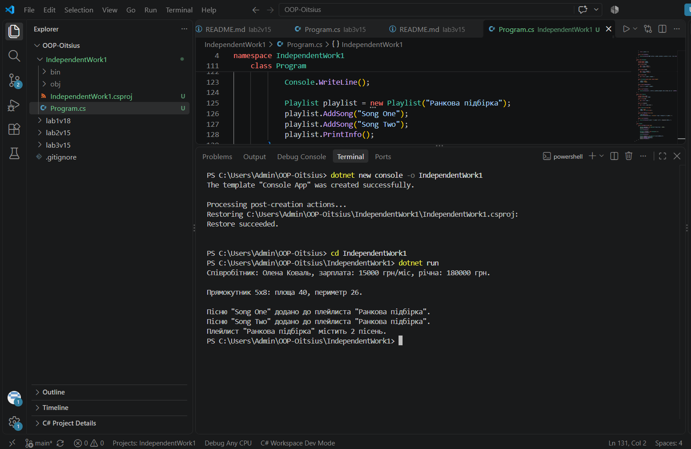

# Самостійна робота №1

**Тема:** Базовий синтаксис C# і оголошення класів.

## Мета

Закріпити навички оголошення класів, полів, властивостей та методів у C# для моделювання об'єктів реального світу.

## Що реалізовано

Три класи, яких не було у списку варіантів лабораторних:

- **Employee** — поля _name, _salary; властивості Name (read-only), Salary; методи CalculateAnnualSalary(), PrintInfo().
- **Rectangle** — поля _width, _height; властивості Width, Height, Area (read-only, обчислювана); методи GetPerimeter(), PrintInfo().
- **Playlist** — поля _name, список _songs; властивості Name (read-only), SongCount (read-only); методи AddSong(), PrintInfo().

## Запуск

cd IndependentWork1 
 dotnet run

## Результат виконання

## Контрольні питання

**1. Які мінімальні елементи повинен містити клас у цьому завданні?**

Мінімум два приватних поля, одну публічну властивість з get (і за бажанням set) для доступу до одного з полів, мінімум один метод з якоюсь логікою, та конструктор для ініціалізації полів.

**2. Чому поля доцільно робити приватними, а доступ до них надавати через властивості?**

Приватні поля захищені від прямого доступу й некоректної зміни ззовні. Властивості дозволяють контролювати, які значення можна записувати (наприклад, через валідацію), не змінюючи при цьому спосіб використання класу ззовні.

**3. Для чого в класі потрібен конструктор і як він пов'язаний зі станом об'єкта?**

Конструктор ініціалізує початковий стан об'єкта одразу під час його створення, гарантуючи, що об'єкт не залишиться з порожніми чи некоректними даними одразу після виклику new.

**4. Як у Main показати, що методи класу працюють коректно?**

Створити об'єкт класу, викликати його методи з конкретними даними та вивести результат у консоль через Console.WriteLine() — якщо вивід відповідає очікуваному результату, це підтверджує коректну роботу методів.

## Джерела

- Класи в C# (Microsoft Docs)
- Властивості (Microsoft Docs)
- Конструктори (Microsoft Docs)

## Стек

- C#
- .NET 10
