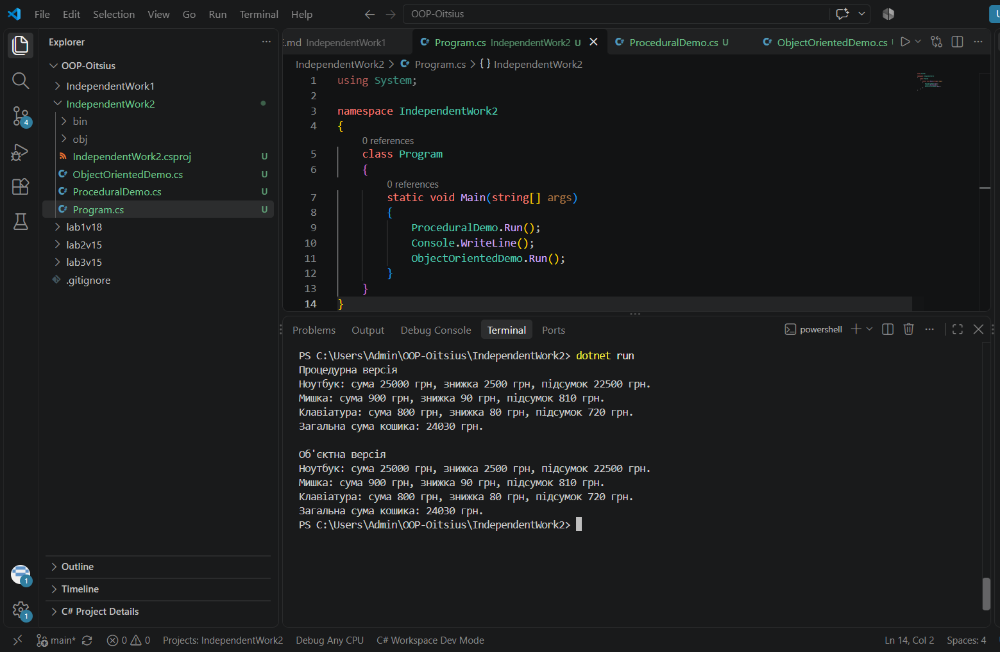

# Самостійна робота №2

**Тема:** Процедурний і об'єктний підходи: порівняння на прикладі.

## Мета

Побачити на практиці різницю між процедурним і об'єктним підходами до організації коду.

## Проблеми процедурної версії

1. Дані про один товар розкидані по трьох паралельних масивах (names, prices, quantities) — щоб дізнатись усе про товар, треба пам'ятати індекс і звертатись до трьох масивів одночасно.
2. Немає жодної гарантії, що масиви мають однакову довжину — якщо забути оновити один з масивів при додаванні товару, програма або впаде, або дасть неправильний результат.
3. Логіку знижки (ApplyDiscount) неможливо повторно використати в іншому сценарії без копіювання коду, бо вона жорстко прив'язана до того, як організовані масиви в конкретному методі.

## Порівняння підходів

- **Структура даних**: у процедурній версії — три окремі масиви; в об'єктній — один клас Product, що об'єднує дані товару.
- **Додавання нової операції (видалення товару)**: у процедурній версії довелось би синхронно змінювати три масиви; в об'єктній — достатньо додати метод RemoveItem у Cart.
- **Повторне використання**: у процедурній версії логіка знижки прив'язана до масивів і 
важко переноситься в інше місце; у об'єктній — Cart можна використати будь-де без змін.

## Запуск

cd IndependentWork2
dotnet run

## Результат виконання

## Контрольні питання

**1. Які конкретні незручності процедурного підходу ви побачили при роботі з паралельними масивами?**

Дані одного товару розкидані по кількох масивах, немає гарантії однакової довжини масивів, і складно передавати "товар" як єдину сутність між методами.

**2. Чому логіка знижки природніше виглядає як метод класу Cart, а не як окрема функція над масивами?**

Бо знижка напряму пов'язана з даними кошика, і як метод класу вона завжди працює з коректними, узгодженими даними об'єкта, а не з довільними масивами, передбачуваність яких не гарантована.

**3. Що саме стало легше змінити чи розширити після переходу на класи?**

Стало легше додавати нову функціональність (наприклад, видалення товару чи підрахунок кількості позицій), бо вся логіка інкапсульована в одному класі Cart, а не розкидана по окремих функціях.

**4. У яких невеликих задачах процедурний підхід все ще залишається достатнім і виправданим?**

У простих одноразових скриптах з невеликою кількістю даних, де немає потреби в повторному використанні логіки чи подальшому розширенні програми.

## Стек

- C#
- .NET 10