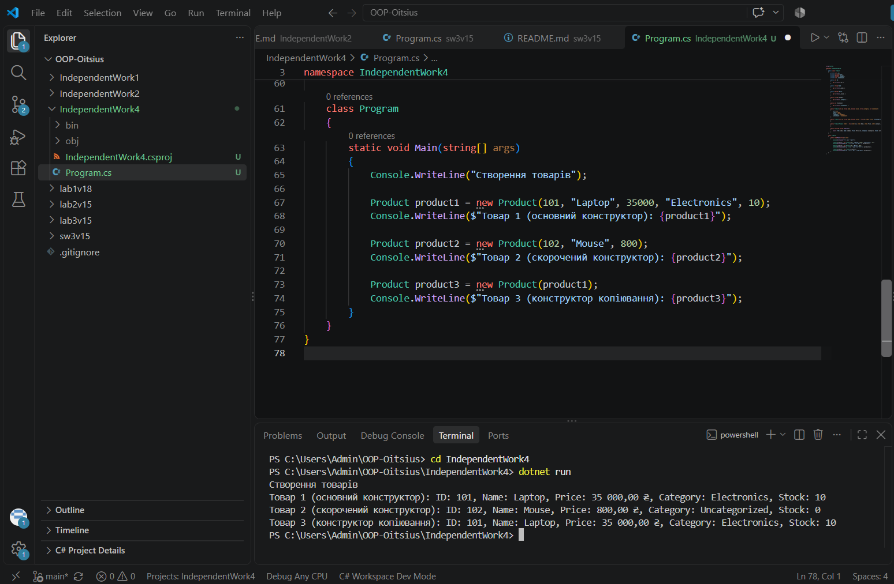

# Самостійна робота №4

**Тема:** Перевантаження конструкторів: приклади та сценарії.

## Мета

Закріпити навички використання перевантажених конструкторів для створення гнучких та зручних у використанні класів.

## Що реалізовано

Клас Product для інтернет-магазину:

- приватні поля _id, _name, _price, _category, _stockCount
- read-only властивості Id, Name, Price, Category, StockCount
- три перевантажені конструктори: основний (всі 5 параметрів), скорочений (id, name, price, викликає основний через : this(...)), копіювання (приймає інший Product, викликає основний через : this(...))
- перевизначений метод ToString()

## Запуск

cd IndependentWork4
dotnet run

## Результат виконання

## Контрольні питання

**1. Навіщо потрібне перевантаження конструкторів у класі Product?**

Дозволяє створювати товари з різним рівнем деталізації — іноді відома лише назва й ціна, іноді повний набір характеристик, без потреби щоразу передавати всі п'ять параметрів.

**2. Чому конструктор копіювання зручно реалізовувати через this(...)?**

Це уникає дублювання логіки ініціалізації — замість повторного присвоєння кожного поля конструктор копіювання просто передає значення полів іншого об'єкта в основний конструктор.

**3. Які переваги дає read-only доступ до властивостей після створення об'єкта?**

Гарантує, що дані товару не можна випадково змінити ззовні після створення об'єкта, що захищає цілісність даних.

**4. У яких випадках перевизначення ToString() спрощує налагодження та демонстрацію роботи класу?**

Коли потрібно швидко вивести зрозумілу інформацію про об'єкт у консоль чи лог без написання окремого методу для форматування щоразу — досить просто передати об'єкт у Console.WriteLine().

## Стек

- C#
- .NET 10