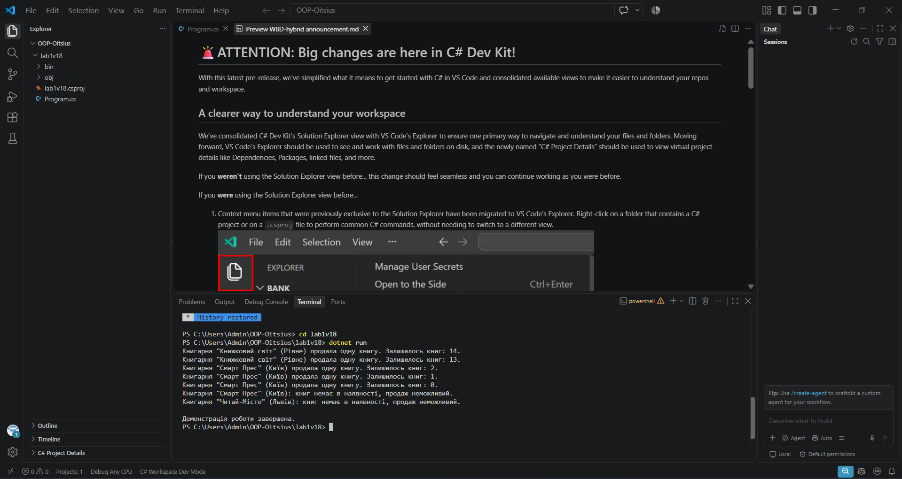

# OOP-Oitsius

Лабораторні роботи з предмету ООП (C#).

## Лабораторна №1

Варіант 18 — клас Bookstore (книгарня).

Що реалізовано:
- приватні поля name, location, booksAvailable
- властивості Name, Location, BooksAvailable
- конструктор
- метод SellBook() - продає книгу, якщо вона є в наявності

Запуск:
cd lab1v18
dotnet run

## Стек
- C#
- .NET 10

## Результат виконання

