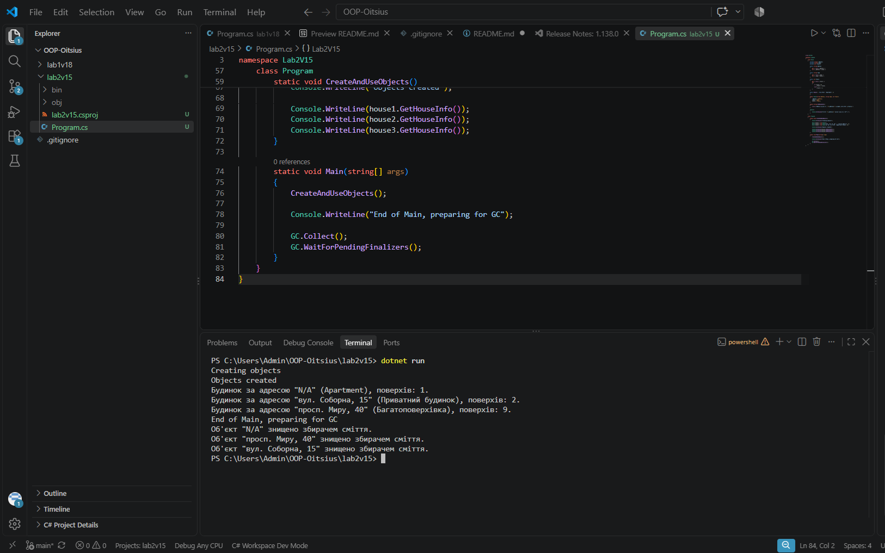

# Лабораторна робота №2

**Тема:** Клас із кількома конструкторами. Життєвий цикл об'єкта.

**Варіант:** 15 — клас House (будинок).

## Мета

Навчитися реалізовувати перевантажені конструктори, дослідити порядок їх викликів та зрозуміти основи життєвого циклу об'єкта в C#.

## Що реалізовано

- приватні поля: _address, _type, _floors
- властивості: Address, Type, Floors (з валідацією: кількість поверхів > 0)
- два перевантажені конструктори: за замовчуванням та параметризований, з ланцюговим викликом через : this()
- метод GetHouseInfo() - повертає інформацію про будинок
- деструктор ~House(), що виводить повідомлення про знищення об'єкта

## Запуск

cd lab2v15
dotnet run

## Результат виконання

## Контрольні питання

**1. Що таке перевантаження конструкторів і яку перевагу воно дає?**

Перевантаження конструкторів - це можливість мати в одному класі декілька конструкторів з різною кількістю або типами параметрів. Це дозволяє створювати об'єкти класу різними, зручнішими способами - наприклад, з мінімальним набором даних або з повним.

**2. Як за допомогою : this() можна уникнути дублювання коду ініціалізації?**

Ключове слово : this() дозволяє одному конструктору викликати інший конструктор того самого класу. Замість того щоб повторювати однаковий код ініціалізації в кожному конструкторі, простіший конструктор передає значення за замовчуванням у більш повний конструктор, де і відбувається вся логіка.

**3. Хто і в який момент викликає деструктор (фіналізатор) у C#?**

Деструктор викликається автоматично збирачем сміття (Garbage Collector) перед тим, як остаточно звільнити пам'ять, зайняту об'єктом, на який більше не залишилось посилань.

**4. Чому в реальних програмах не рекомендується викликати GC.Collect() вручну?**

Примусовий виклик GC.Collect() змушує збирач сміття працювати поза його оптимізованим графіком, що може призвести до зниження продуктивності програми. GC сам вирішує, коли найефективніше проводити очищення пам'яті, і втручання в цей процес вручну зазвичай тільки шкодить.

## Висновок

У ході виконання лабораторної роботи реалізовано клас House з перевантаженими конструкторами та ланцюговим викликом через : this(). Продемонстровано повний життєвий цикл об'єкта: створення трьох об'єктів різними конструкторами, використання методу GetHouseInfo(), а також примусовий виклик збирача сміття, який підтвердив коректну роботу деструктора для кожного об'єкта.

## Стек

- C#
- .NET 10