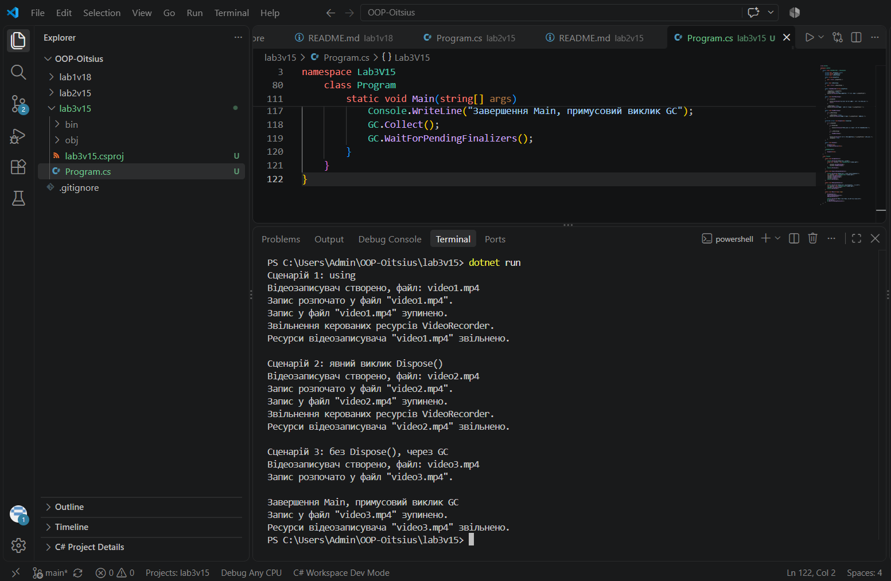

# Лабораторна робота №3

**Тема:** Життєвий цикл об'єкта та керування ресурсами.

**Варіант:** 15 — клас VideoRecorder (відеозаписувач).

## Мета

Поглибити розуміння життєвого циклу об'єкта в C#, навчитися працювати з некерованими ресурсами, реалізувати інтерфейс IDisposable та патерн Dispose.

## Що реалізовано

- приватні поля: _outputFile, _isRecording, _disposed
- публічні властивості: OutputFile, IsRecording
- конструктор, що "виділяє ресурс" (створює відеозаписувач для файлу)
- методи StartRecording(), StopRecording()
- повна реалізація IDisposable: публічний Dispose(), захищений віртуальний Dispose(bool disposing), деструктор ~VideoRecorder(), що викликає Dispose(false)
- GC.SuppressFinalize(this) у публічному Dispose()

## Запуск

cd lab3v15
dotnet run

## Результат виконання

Продемонстровано три сценарії:
1. Створення об'єкта через using - Dispose() викликається автоматично після виходу з блоку
2. Створення об'єкта без using з явним викликом Dispose()
3. Створення об'єкта без виклику Dispose() - ресурси звільняються через деструктор після GC.Collect()

## Контрольні питання

**1. Що таке життєвий цикл об'єкта в .NET?**

Це послідовність етапів, через які проходить об'єкт: створення (виділення пам'яті в купі та виклик конструктора), використання (робота через посилання на об'єкт) та знищення (коли посилань на об'єкт більше немає, збирач сміття звільняє зайняту ним пам'ять).

**2. Яка різниця між керованими та некерованими ресурсами?**

Керовані ресурси - це пам'ять, виділена для звичайних .NET об'єктів, яку автоматично звільняє збирач сміття. Некеровані ресурси - це файлові дескриптори, мережеві з'єднання та інші ресурси поза контролем .NET, які GC самостійно звільнити не може, тому їх треба звільняти явно.

**3. Для чого призначений інтерфейс IDisposable?**

Він визначає стандартний спосіб явного звільнення некерованих ресурсів через метод Dispose(), замість того щоб покладатись лише на непередбачуваний момент виклику збирача сміття.

**4. Як оператор using допомагає в керуванні ресурсами?**

Оператор using гарантує, що метод Dispose() об'єкта буде викликаний автоматично одразу після виходу з блоку коду, навіть якщо всередині блоку виникне виняток.

**5. Навіщо в патерні Dispose використовується метод GC.SuppressFinalize()?**

Якщо ресурси вже звільнено вручну через Dispose(), немає потреби, щоб збирач сміття ще раз викликав фіналізатор для цього об'єкта. GC.SuppressFinalize(this) прибирає об'єкт із черги на фіналізацію, що економить ресурси та пришвидшує роботу GC.

**6. Чому в деструкторі викликається Dispose(false), а в методі Dispose() - Dispose(true)?**

Параметр показує, чи безпечно звертатись до інших керованих об'єктів. Dispose(true) означає, що метод викликаний явно користувачем, тож керовані ресурси ще існують і їх можна коректно звільнити. Dispose(false) означає виклик з деструктора під час роботи GC, коли керовані об'єкти вже можуть бути знищені, тому звільняються лише некеровані ресурси.

## Висновок

У ході виконання лабораторної роботи реалізовано клас VideoRecorder з повним патерном Dispose. Продемонстровано різницю між трьома сценаріями звільнення ресурсів: при використанні using ресурси звільняються одразу та передбачувано в момент виходу з блоку; при явному виклику Dispose() звільнення відбувається в чітко визначений момент за бажанням розробника; а без виклику Dispose() звільнення ресурсів відкладається до непередбачуваного моменту роботи збирача сміття, що на практиці є ненадійним підходом і демонструє, чому явне керування ресурсами (using або Dispose()) є кращою практикою.

## Стек

- C#
- .NET 10