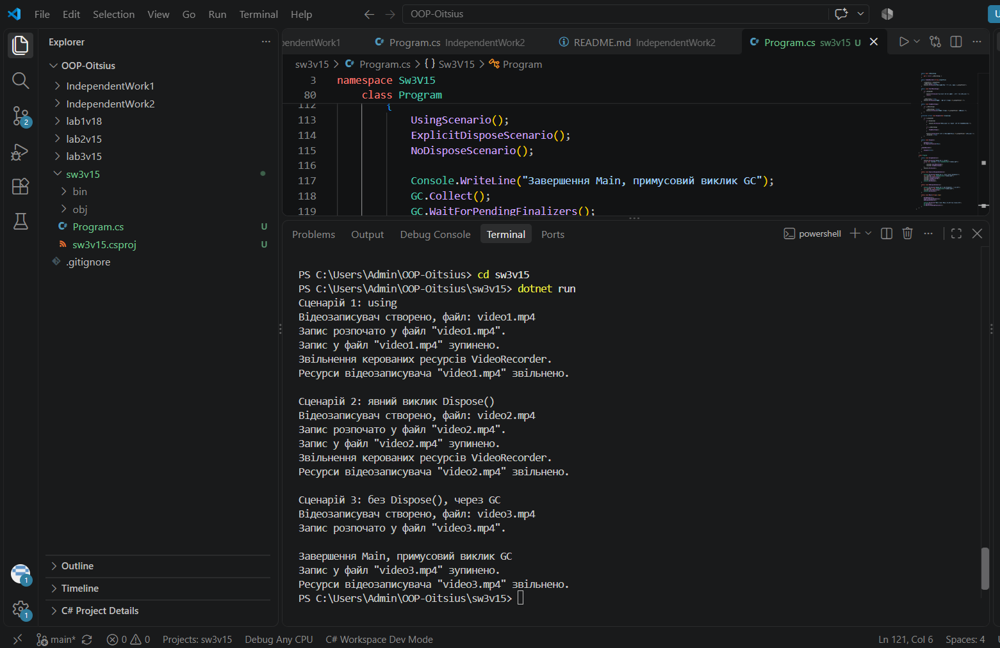

# Самостійна робота №3

**Тема:** Життєвий цикл об'єкта та керування ресурсами.

**Варіант:** 15 — клас VideoRecorder.

## Мета

Поглибити розуміння життєвого циклу об'єкта в C#, самостійно реалізувати інтерфейс IDisposable та патерн Dispose.

## Що реалізовано

- приватні поля _outputFile, _isRecording, _disposed
- публічні властивості OutputFile, IsRecording
- повна реалізація IDisposable: Dispose(), Dispose(bool disposing), деструктор ~VideoRecorder()
- GC.SuppressFinalize(this) у Dispose()

## Запуск

cd sw3v15
dotnet run

## Результат виконання

## Висновок

Три сценарії демонструють різні моменти звільнення ресурсів. При using звільнення відбувається одразу й передбачувано після виходу з блоку. При явному виклику Dispose() момент звільнення визначає сам розробник. А без виклику Dispose() звільнення ресурсів відкладається до непередбачуваного моменту роботи збирача сміття, що на практиці є ненадійним підходом і зайвим навантаженням на GC.

## Контрольні питання

**1. Що таке життєвий цикл об'єкта в .NET?**

Послідовність етапів: створення (виділення пам'яті та виклик конструктора), використання (робота через посилання) та знищення (звільнення пам'яті збирачем сміття, коли посилань більше немає).

**2. Яка різниця між керованими та некерованими ресурсами?**

Керовані ресурси автоматично звільняє GC. Некеровані (файли, мережеві з'єднання) GC звільнити не може, їх треба звільняти явно.

**3. Для чого призначений інтерфейс IDisposable?**

Стандартизує спосіб явного звільнення некерованих ресурсів через метод Dispose().

**4. Як оператор using допомагає в керуванні ресурсами?**

Гарантує виклик Dispose() одразу після виходу з блоку коду, навіть якщо виникне виняток.

**5. Навіщо в патерні Dispose використовується метод GC.SuppressFinalize()?**

Прибирає об'єкт з черги фіналізації GC, якщо ресурси вже звільнено вручну — економить ресурси GC.

**6. Чому в деструкторі викликається Dispose(false), а в методі Dispose() - Dispose(true)?**

Dispose(true) означає явний виклик користувачем, коли керовані об'єкти ще існують. Dispose(false) — виклик з деструктора під час роботи GC, коли керовані об'єкти вже можуть бути знищені, тому звільняються лише некеровані ресурси.

## Стек

- C#
- .NET 10